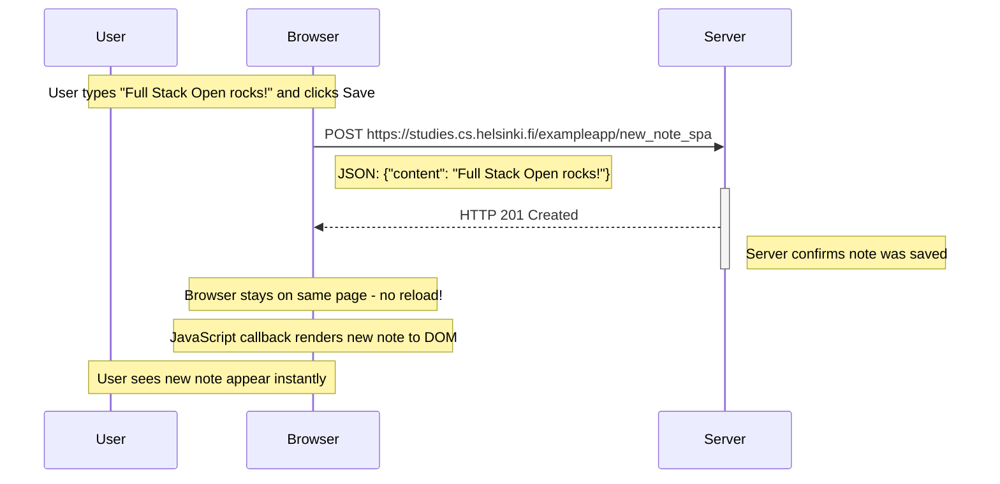

```mermaid
sequenceDiagram
    participant User
    participant Browser
    participant Server

    Note over User, Browser: User types "Full Stack Open rocks!" and clicks Save
    
    Browser->>Server: POST https://studies.cs.helsinki.fi/exampleapp/new_note_spa
    Note right of Browser: JSON: {"content": "Full Stack Open rocks!"}
    activate Server
    Server-->>Browser: HTTP 201 Created
    Note right of Server: Server confirms note was saved
    deactivate Server
    
    Note over Browser: Browser stays on same page - no reload!
    Note over Browser: JavaScript callback renders new note to DOM
    Note over User, Browser: User sees new note appear instantly
```